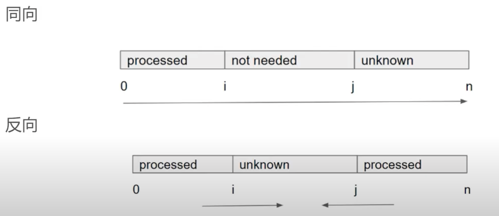

# Algorithms & Data Structure Notes


- Cheat Sheets
- Tricks

- DS Basics:
  - Array
  - String
  - ArrayList
  - LinkedList
  - Queue
  - Stacck
  - HashMap
  - HashSet
  - Heap


- Data Structures:
  - Linear: String, Array, LinkedList, Stack, Queue
  - Nonlinear: Binary Tree, Heap, HashMap, Graph
- Algorithms:
  - Search (BFS, DFS)
  - Sort
  - Greedy
  - Divide & Conquer
  - Dynamic Programming
  - Backtrack
- Logics:
  - Recursive
  - Two Pointers
  - Binary Search
  - Sliding Window

---


## 0 Cheat Sheets

### 0.1 Java DS Hierarchy (from [here](https://malalanayake.wordpress.com/2014/09/26/selecting-proper-data-structures-for-the-realtime-problems/))


### 0.2 Java Collections Cheat Sheet (from [here](https://medium.com/elevate-java/java-collections-cheat-sheet-97a33354a169))


### 0.3 Big-O Cheat Sheet (from [here](https://www.forparkinson.com/BigDataChapter/blog/2019/09/29/datascience-cheatsheet))


---


## 1 Tricks

  1. When dealing with JUST lower-case English letters, int[26] can act like a HashMap, where indices (keys) indicate letters and elements indicate values needed, e.g., frequency.
  2. HashMap + ArrayList can achieve O(1) average insert & delete & getRandomElement time complexity.
  3. HashMap + minHeap to get top-K frequent elements in an array.
  4. || short circuits but | does not - both sides of the OR get evaluated with |, so we explore all possible routes.
  5. Dequeue can work as a stack and queue simultaneously even.
  6. Adding or removing (or even changing) just one character anywhere in a string is O(n), because strings are immutable. The entire string is rebuilt for every change.
  7. Adding or removing not from the end of a list, vector, or array is O(n) because the other items are moved up to make a gap or down to fill in the gap.
  8. Checking if an item is in a list is O(n), because this requires a linear search. Even if you use binary search, it'll still be O(logn).
  9. StringBuilder append char is O(1), sb.toString() is O(n).
  10. The inorder traversal of a BST gives the elements in a sorted order. 
  11. Calculate 2^n: fast shift: 1 << n;
  12. Sort 2D array based on one dimension: Arrays.sort(arr, (a, b) -> Double.compare(a[0], b[0]);
  13. Sort 2D array based on descending first dimension & then ascending second dimension: 
  ```
  Arrays.sort(arr, (a, b) -> (a[0] == b[0]) ? (a[1] - b[1]) : (b[0] - a[0])); 
  ```
  OR ```Arrays.sort(arr, (a, b) -> {if (a[0] == b[0]) {return a[1]-b[1];} return b[0]-a[0];});``` O(nlogn);
  
  
  14. An array of length n has n(n+1)/2 total contiguous subarrays.
  15. Use ArrayDeque for Stack.
  16. (logn)^2 < n.
  17. Use binary search in binary search to find how many nodes exist in last level of a complete binary tree, O((logn)^2).
  18. Use HashSet to store 2D matrix (mxn) postion: val = row * m + n. If have the val, row = val / m, col = val % m.
  19. Use Bezout's identity to check if z is a multiple of GCD(x, y).
     - Bezout's identity/lemma: let x and y be nonzero integers and let z be their greatest common divisor. Then there exist integers a and b such that ax+by=z. In addition, the greatest common divisor z is the smallest positive integer that can be written as ax + by. every integer of the form ax + by is a multiple of the greatest common divisor z.
  20. Unify row & col: add row or col index with a large value so that row can represent a single row and col can represent a single column even when their values are the same! This way turns a rowxcol 2D matrix into a row+col 1D array.
  21. When exploring graph cells, pay attention to when to mark a cell visited. Typically mark on the fly, but sometimes previously traversed cells might be retraversed for updating relevant info, and only marked visited when actually exploring from those cells.
  22. Convert 2D matrix position matrix[i][j] to 1D array index: arr[i*n+j].
  23. Convert 1D array index arr[i] to 2D matrix position: matrix[i/n][i%n].
  24. Get each digit of a number from left to right: String str = num + ""; for (char c : str.toCharArray()) {};
  25. Integer.parseInt(string) gives int without leading zeros.
  26. Check is a char is vowel or not: "AEIOUaeiou".indexOf(c) < 0 ? false : true;
  27. Compare Strings in lexicographical order: str1.compareTo(str2) > 0 ? str1Larger : str2Larger;
  28. In 2D matrix, same (row-col) values belong to same diagonal line in matrix.
  29. In 2D matrix, numbers in same antidiagonal line have same i+j.


---


## 2 DS Basics

### 2.0.1 Object (can be used to package multiple dimension of information)
- Create an object class:
```
class Object {
    Type1 var1;
    Type2 var2;
    
    Object(Type1 var1, Type2 var2) {
        this.var1 = var1;
        this.var2 = var2;
    }
}
```

### 2.0.2 Comparator
- Define: 
```
Comparator<Object> comparator = new Comparator<Object>() {
    public int compare(Object o1, Object o2) {
        ...
    }
};
```
- Create comparator: Comparator\<Object\> comparator = (obj1, obj2) -> {return obj1.var1 - obj2.var2;};
- Use for sorting: Collections.sort(List\<Object\> list, comparator);
- Compare high-dimension arrays (in list) based on each dimension:
```
        // O(l^2 * logl)
        Collections.sort(list, (a, b) -> {
            for (int i = 0; i < l; i++) {
                if (map.get(a)[i] != map.get(b)[i]) {
                    return map.get(b)[i] - map.get(a)[i];
                }
            }
            // tied for all rank positions, rank alphabetically
            return a - b;
        });
        
        if just on one dimention:
        Collections.sort(list, Comparator.comparing(o -> +/-o[0]);
```
- Compare 2D arrays based on each dimension:
```
        // O(nlogn)
       Arrays.sort(arr, new Comparator<int[]>() {
          public int compare(int[] a, int[] b) {
              if (a[0] == b[0]) {return b[1] - a[1];}
              else {return a[0]-b[0];}
          }
      });
      
      if only sort on one dimension: 
      OR
      Arrays.sort(arr, (a,b) -> a[0] - b[0]);
      OR 
      Arrays.sort(arr, (a,b) -> Integer.compare(a[0]-b[0]));
```

- Define comparator function in Heap: (new PriorityQueue<>((a,b) -> b - a); can lead to overflow error!)

```
PriorityQueue<Integer> maxHeap = new PriorityQueue<>(
    new Comparator<Integer>() {
        public int compare(Integer a, Integer b) {
            return b.compareTo(a);
        }
    }
);
```

### 2.0.3 String Split
- by "(": str.split("\\\\(");
- by one or more spaces: str.split("\\\\s+");
- by ".": str.split("\\\\.");


### 2.0.4 Integer
- Integer vs int: 
  - Integer is wrapper class type, int is primitive type. 
  - Integer has more flexibility in manipulating int data.
  - Integer can == null, int cannot.


### 2.0.5 Binary Search Tree
- Three characteristics:
  - Inorder traversal of BST is an array sorted in ascending order.
  - Successor: go to the right once (if have) and then as many times to the left as could.
    - if no right child, successor is upper: go up till the node that is left child of its parent, parent is the successor, could be no successor!
  ```
  public TreeNode successor(TreeNode root) {
    root = root.right;
    while (root.left != null) {
        root = root.left;
    }
    return root;
  }
  ```
  - Predecessor: go to the left once and then as many times  to the right as could.
  ```
  public TreeNode predecessor(TreeNode root) {
      root = root.left;
      while (root.right != null) {
        root = root.right;
      }
      return root;
  }
  ```
- Inorder traversal is not a unique identifier of BST. Both preorder and postorder are.
- BST can be constructed from preorder or postorder traversal only.
- **Binary Tree can be constructed from preorder/postorder + inorder traversal.**
- Inorder traversal of a sorted array does not give unique BST. Use median of array (left or right) as root to recursively(preorder dfs) construct BST.


### 2.0.6 Stream
- Convert a list to an int array: List\<Integer\> list = new ArrayList<>(); int[] arr = list.stream().mapToInt(i -> i).toArray();
  - first i is type of stream elements, second i is primitive int-valued elements.  


### 2.0.7 Bitwise Operation
- '&': bitwise AND
  - bitwise AND between even number (ends in 0) and 1 is 0/false.
  - bitwise AND between odd number (ends in 1) and 1 is 1/true. 
- Shift operator
  - number << n = number * 2^n
  - number >> n = number / 2^n
- Flip 0 <-> 1: num ^= 1;
- Integer.bitCount(int n) returns count of one-bits in the number.


### 2.0.8 Math
- Greatest common divisor gcd(a,b):
```
private int gcd(int a, int b) {
    if (a == 0) {return b;}
    return gcd(b%a, a);
}
```
- Least common multiple lcm(a,b) = a*b/gcd(a,b);


### 2.0.9 Random
- Initialize: Random r = new Random();
- Generate a random between [0,n]: r.nextInt(n);


### 2.1 Array
- Package: java.util.Arrays;
- Initialize: type[][] array = new type\[size1\]\[size2\]; int[] a = {1,2,3,4};
- Access Element: array[i][j];
- Change Element: array[i][j] = e;
- Array Length: array.length;
- Sort: Arrays.sort(array); O(nlogn)
- Fill: Arrays.fill(array, e);
- Copy: Arrays.asList(array);
- Convert to String: String.valueOf(array);
- Check equal: Arrays.equals(arr1, arr2); O(n).
- int[] get sum of all nums: int sum = Arrays.stream(nums).sum(); O(n).
- Copy partial array: newArr = Arrays.copyOf(arr, newLength);
- Convert from List<E[]> list: list.toArray(new E[list.size()][]);


  

### 2.2 String
- Package: java.lang.String;
- Initialize: String str = e; String str = new String(e);
- New string from char[]: String str = new String(arr);
- String Length: str.length();
- Concatenate: str1.concat(str2); str1 + str2;
- Get Char: str.charAt(i);
- Check Start With from index 0: str.startsWith(substr);
- Check start withh from index i: str.startsWith(substr, i);
- Check End: str.endsWith(e);
- Check Equals: str1.equals(str2);
- Get First Index: str.indexOf(substr);
- Get Last Index: str.lastIndexOf(substr);
- Search index from ith position: str.indexOf(substr, i);
- Get Substring: str.substring(i1, i2);
- Convert int to String: int + "";
- Convert String to int: Integer.parseInt(str);
- Convert Char Array to String: String str = new String(arr);
- Convert To Char Array: str.toCharArray(); "to make string mutable"
  - str.toCharArray() takes O(n) time and space
  - for (char c : str.toCharArray()) takes O(n) time
- Reverse String: String revStr = new StirngBuilder(str).reverse().toString(); O(n) time and space.
- Ignore Head&Tail Whitespace: str.trim();
- Check Contains: str.contains(e);
- Check Empty: str.isEmpty();
- Check Null: str == null;
- Get String Format: String.valueOf(e); e can be int, array, boolean, etc. More flexible than Integer.toString(intValue).
  - **Note:** String.valueOf(array) returns a string, String.valueOf(list) returns a string format of the list (i.e., just add "" around list).
- Sort a String: char[] array = string.toCharArray(); Arrays.sort(array); String newString = String.valueOf(array);
- Iterate a String: for (char c : str.toCharArray()) {};
- Add char to String: str += char;
- Split string and get string array: String[] array = str.split("/");
- Split string for k-1 times: String[] arr = str.split(" ", k);
- Parse string as a signed decimal integer: Integer.parseInt(str); 
- String compare (lexicographically): str1.compareTo(str2); returns 0 if equal, negative number if str1<str2, positve number if str1>str2.
- Extract postfix: str.subtring(i); -> returns substring [i, str.length());
- Replace substirng: str.replace("str1", "str2");
- Remove substring: str.replace("str1", "");
- Repeat a string n times: String newStr = str.repeat(n);
- Compare two stirngs lexicographically: str1.compareTo(str2); returns 0 if equal, <0 if str1 < str2, >0 if str1 > str2.
- Connect strings in array arr with str2: String newStr = String.join(str2, arr);

### 2.2.1 StringBuilder (frequent string concatenation)
- Initialize: StringBuilder sb = new StringBuilder();
- Initialize: StringBuilder sb = new StringBuilder(int_size));
- Initialize from String: StringBuilder sb = new StringBuilder(str);
- Add Element: sb.append(e);
- Convert to String: sb.toString();  O(n)
- Remove ith character: sb.deleteCharAt(i);
- Add character or string at ith: sb.insert(i, ch/str);
- Remove last character: sb.deleteCharAt(sb.length()-1);
- Remove chars in range [i, j]: sb.delete(i, j + 1);
- Clear: sb.setLength(0);


### 2.2.2 Character
- Math: c1 +/- c2 = intValue;
- Convert char to intValue: c1 - '0';
- Convert lowercase letter to index: c1 - 'a';
- **Convert int to char:** (char) (intValue + '0');
  - if not add '0', the ACSII char of the given number will be used!
  - adding '0' with int variable will return the actual valie in the char variable
- Math: c1 +/- intValue = intValue(c2);
- Math: c1 +/- number = c2;
- Check Digit: Character.isDigit(ch);
- Check letter or digit: Character.isLetterOrDigit(ch);
- Check Whitespace: Character.isWhitespace(ch);
- Check lowercase letter: Character.isLowerCase(ch);
- Check letter: Character.isLetter(ch);
- Conver letter to lowercase: Character.toLowerCase(ch);
- ch.charValue(): return primitive char value of the ch object.
- get numeric value: Character.getNumericValue(ch);

### 2.3 ArrayList (dynamic; frequent random access)
- Package: java.util.ArrayList
- Initialize: ArrayList\<E\> list = new ArrayList<>();
- Initialize from numbers: List<\Integer\> list = new ArrayList\<Integer\>(Arrays.asList(num1, num2,...));
- Initialize from HashMap keyset: List\<E\> list = new ArrayList<>(map.keySet());
- Convert from Array: List\<Integer\> list1; Integer[] a = {0,1,2,3,4}; list1 = new ArrayList<>(Arrays.asList(a)); OR list1 = new ArrayList<>(Arrays.asList(e1,e2,..);
- Convert set to arraylist: list = new ArrayList<>(set);
- Convert to Array(ONLY works for array of reference types!): list.toArray(new type\[list.size()\]);
- Copy: List\<Integer\> list2 = new ArrayList<>(list1);
- From List Interface:
  - Add Element: list.add(e); list.add(i,e);
  - Access Element: list.get(i);
  - Change Element: list.set(i, e);
  - Remove Element: list.remove(i);
  - Delete LAST Element: list.remove(list.size()-1);
- From Collection Interface:
  - Size: list.size();
  - Empty Check: list.isEmpty();
  - Sort (ascending): Collections.sort(list); O(nlogn)
    - In Java, Collections.sort() dumps the list into an array taking O(n) space, then Arrays.sort() for primitives implemented as a variant of quicksort algorithm whose space complexity is O(logn).
  - Sort part of list (ascending): Collections.sort(list.subList(i, j));
  - Remove All Elements: list.clear();
  - Contains Element: list.contains(e);
  - Get a random element: Random rand = new Random(); list.get(rand.nextInt(list.size()); O(1) TC.
- Iterae a custom index range and do sth: list.subList(i, j).forEach(v -> sb.append(v));


### 2.4 LinkedList (frequent add/remove)
- Package: java.util.LinkedList;
- Initialization: LinkedList\<E\> list = new LinkedList<>();
- Same methods from ArrayList & Queue
- Find Element: list.indexOf(e);
- Own (more efficient):
  - addFirst(e), addLast(e), removeFirst(), removeLast()
  - getFirst(), getLast()
- Add in reverse order: list.add(0, e);


### 2.5 Queue
- Package: jave.util.Queue;
- Initialize: Queue\<E\> queue = new LinkedList<>();
- Own:
  - Add Element: queue.offer(e);
  - Poll Element: queue.poll();
  - Peek Element: queue.peek();
    - return special value, not throw exception
  - Add all: queue.addAll(Collection\<E\>);
    - add all list elements to queue: queue.addAll(list);
- From Collection Interface:
  - clear(), contains(e), isEmpty(), size()


### 2.5.1 ArrayDeque (Array Double Ended Queue)
- Implements two interfaces: Queue, Deque (Deque extends Queue)
- Dynamic, not thread-safe
- Null elements prohibited
- likely faster than Stack when used as a Stack
- likely faster than Queue when used as a Queue
- Initialize: Deque\<E\> deque = new ArrayDeque\E\>();
- Add all: deque.addAll(Collection);
- Add at start: deque.addFirst(e); OR deque.offerFirst(e);
- Add at end: deque.add(e); OR deque.addLast(e); OR deque.offerLast(e);
- Get first: deque.getFirst(); deque.peek(); deque.peekFirst();
- Get last: deque.getLast(); deque.peekLast();
- Poll first: deque.poll(); deque.pollFirst();
- Poll last: deque.pollLast();


### 2.6 Stack
- Extends Vector Class, Implements List Interface
- Initialize: Stack\<E\> stack = new Stack<>();
- Own:
  - Push Element: stack.push(e);
  - Pop Element: stack.pop();
  - Peek Element: stack.peek();
  - Check Empty: stack.empty();
  - Search Element Position: stack.search(e);
- From Vector Class:
  - contains(e), isEmpty(), size()
- Iterate through stack (**bottom to top**): for (String str/Character c : stack) {}; 
- Convert Stack\<Character\> to string: stack.toString() OR String.valueOf(stack);


### 2.7 HashMap
- Package: java.util.HashMap;
- Initialize: Map<K, V> map = new HashMap<>();
- Initialize: Map<K, V> map = new HashMap<>(Map.of(k1, v1, k2, v2,...));
- Own:
  - Add Pair: map.put(k, v);
  - Add NEW Pair: map.putIfAbsent(k, v);
  - Get Value: map.get(k);
  - Get Or Default: map.getOrDefault(k);
  - Remove Pair: map.remove(k);
  - Remove All Pairs: map.clear();
  - Size: map.size();
  - Check Empty: map.isEmpty();
  - Get set of all keys: map.keySet();
  - Get values in array: map.values();
  - Check Key: map.containsKey(k);
  - Check Value: map.containsValue(v);
  - Remove a <k,v> pair and return v: value = map.remove(key);
  - Put all \<k, v\> entries into list: List<Map.Entry\<K, V\>> list = new ArrayList<>(map.entrySet());
  - Sort map using list: Collections.sort(list, (a, b) -> a.getValue() == b.getValue() ? b.getKey() - a.getKey() : a.getValue() - b.getValue());
  - Iterate \<k, v\> entries in list: for (Map.Entry\<K, V\> entry : list) {}
  - **Iterate**: 
  ```
  for (Map.Entry<Integer, Integer> entry : hashmap.entrySet()) {
      System.out.print("(" + entry.getKey() + "," + entry.getValue() + ") ");
  }
  ```
  - Return all values as List: return new ArrayList(map.values());
  - Print map to string: map.toString();
  - map.computeIfAbsent(key, remappingFunction): compute value for a given key using the given mapping function, if key is not already associated with a value (or is mapped to null) and enter that computed value in Hashmap else null.
    - example: map.computeIfAbsent("key5", k -> 2000 + 33000);
    - returns current (existing or computed) value associated with the specified key, or null if mapping returns null.

  - Sort function by defining Comparator (sort an arraylist of Pairs): 
  ```
  Collections.sort(list, new Comparator<Pair<Integer, Integer>>() {
      @Override
      public int compare(Pair<Integer, Integer> p1, Pair<Integer, Integer> p2) {
          if (p1.getKey().equals(p2.getKey())) {
              return p1.getValue() - p2.getValue();
          }
          else {return p1.getKey() - p2.getKey();}
      }
  });
  ```
  - Add value into valueList: map.putIfAbsent(key, new ArrayList<>()); map.get(key).add(value);
          

### 2.7.2 Pair
- Pair<K, V>
- get key: pair.getKey();
- get value: pair.getValue();
- add new Pair: X.add(new Pair<K, V>(k,v));


### 2.7.3 TreeMap
- Initialize: TreeMap<K, V> map = new TreeMap<>();
- Add <k, v> pair: map.put(k, v);
- Get <k,v> pair with largest key <= given key: map.floorEntry(key); O(logn)
- map.ceilingKey(a): returns smallest key >= a;
- map.floorKey(b): returns largest key <= b;
- map.higherKey(a): returns smallest key > a;
- map.lowerKey(b): returns largest key < b; O(logn).
- map.remove(key): remove key; O(logn).
  

### 2.8 HashSet
- Package: java.util.HashSet;
- Initialize: HashSet\<E\> set = new HashSet<>();
- Initialize from array: HashSet\<E\> = new HashSet<>(array); O(n).
- Own:
  - Add Element: set.add(e);
  - Check Existence: set.contains(e);
  - Remove Element: set.remove(e);
  - Remove All Elements: set.clear();
  - Size: set.size();
  - Check Empty: set.isEmpty();
  - Iterate: for (E e : set);
  - Iterator: set.iterator().next(); // randomly returns set value
  - Add entire array into set: Collections.addAll(set, array);
  - Dump entire list into set: set.add(list);


### 2.8.1 TreeSet (Ordered set, O(logn) for add/remove/search)
- Initialize: TreeSet\<E\> set = new TreeSet<>();
- Add element per same sorting order with initiation: set.add(e); for numbers - increasing order, for strings - ascending alphabetically.
- Remove element: set.remove(e);
- TreeSet ceiling: set.ceiling(k); return min element >= k, if no return null. O(logn).
- TreeSet subset: Set\<Integer\> set = treeset.subSet(left, right); O(logn).
  
  
### 2.9 Heap
- Use PriorityQueue Class
- Initialize: PriorityQueue\<E\> minHeap = new PriorityQueue<>((a,b) -> a - b), OR = new PriorityQueue<>();
- Initialize: PriorityQueue\<E\> maxHeap = new PriorityQueue<>(Collections.reverseOrder());
- Add Element: minHeap.add(e);
- Peek Element: minHeap.peek();
- Poll Element: minHeap.poll();
- Remove All Elements: minHeap.clear();
- Check Existence: minHeap.contains(e);
- Size: minHeap.size();
- Check Empty: minHeap.isEmpty();
- Convert to String: heap.toString(); -> to check all elements in the heap.
- Compare along certain dimension of array: int[] entry = {int x, int y}; PriorityQueue\<int[]\> maxHeap = new PriorityQueue<>((a,b) -> b[0] - a[0]);
- Iterate elements in heap: 
```
Iterator iter = heap.iterator();
while (iter.hasNext()) {
    next = (E) iter.next();
}
```
  
  


### 2.10 Graph

- Ways to build adjacency list (graph):
  - List<List\<E\>>
    - TC=O(V+E), SC=O(V+E)
```
  List<List<Integer>> adjList = new ArrayList<>();
  for (int i = 0; i < nodes; i++) {
    adjList.add(new ArrayList<>();
  }
  for (int[] edge : int[][] edges) {
    adjList.get(edge[0]).add(edge[1]);
    adjList.get(edge[1]).add(edge[0]);
  }
  
  // traverse neighbors in dfs
  for (int neighbor : adjList.get(node)) {}
  
```

  - Map<E, List\<E\>>
    - TC=O(V+E), SC=O(V+E)
```
  Map<Integer, List<Integer>> adjList = new HashMap<>();
  for (int[] edge : int[][] edges) {
    adjList.computeIfAbsent(edge[0], k -> new ArrayList<>()).add(edge[1]);
    adjList.computeIfAbsent(edge[1], k -> new ArrayList<>()).add(edge[0]);
  }
  
  // or can wirte as
  for (int[] edge : int[][] edges) {
    adjList.putIfAbsent(edge[0], new ArrayList<>());
    adjList.putIfAbsent(edge[1]. new ArrayList<>());
    
    adjList.get(edge[0]).add(edge[1]);
    adjList.get(edge[1]).add(edge[0]);
  }
  
  
  // traverse neighbors in dfs, TC=O(V)
  for (int neighbor : adjList.get(node) {}
  
```


  - List<Set\<E\>>
    - TC=O(V+E), SC=O(V+E)
```
  List<Set<Integer>> adjList = new ArrayList<>();
  for (int i = 0; i < nodes; i++) {
    adjList.add(new HashSet<>();
  }
  for (int[] edge : int[][] edges) {
    adjList.get(edge[0]).add(edge[1]);
    adjList.get(edge[1]).add(edge[0]);
  }
  
  // traverse neighbors in dfs
  for (int neighbor : adjList.get(node)) {}
  
```


---


## 3 Data Structures:
### 3.1 Linked List (Two Pointers, Recursion)

#### LeetCode Problems (58):

- 237 - Delete Node In a Linked List
- 141 - Linked List Cycle
- 92 - Reverse Linked List II
- 25 - Reverse Nodes In k-Group

#### Overview:

- class ListNode {int val; ListNode next;}
- cannot use indexing: O(n) Access
- add element at end: O(n) Add, DoubleLinkedList O(1) Add
- delete requires locating element: O(n) Delete

#### Two Pointers:

- Intuitive:
  - two pointers point to Linked List nodes, not index
  - moving same direction
  - spacing & respective speed
- Find Middle Node:
  - initialize 2 pointers i & j pointing to the head (j faster)
  - while j inside bound (j != null && j.next != null), move j 2 steps and i 1 step forward
  - return the node at i
- Find k-th Node From End:
  - initialize 2 pointers i & j pointing to the head
  - move j k steps forward
  - move both i & j one step forward at a time until j is out of bound

#### Recursion:

- Bottom-up Recursion Three Steps: (step 1 & 3 have consistent value)

  - ask for subproblem result

  - do something in currently level of recursion

  - return result

    Note: trust your recursive function

- Reverse Linked List

  - ask for next recursion level result
  - reverse current node (head.next.next = head; head.next = null;)
  - return reversed head

---


### 3.2 Stack

#### LeetCode Problems (109):

- 739 - Daily Temperatures
- 735 - Asteroid Collision
- 20 - Valid Parentheses
- 496 - Next Greater Element I
- 503 - Next Greater Element II
- TO-DO:
- 394 - Decode String
- 636 - Exclusive Time of Functions
- 84 - Largest Rectangle in Histogram
- 1130 - Minimum Cost Tree From Leaf Values
- 907 - Sum of Subarray Minimums
- 901 - Online Stock Span  
- 856 - Score of Parentheses
- 42 - Trapping Rain Water  

#### Overview:

- LIFO

- suitable for recording previous state and going back to previous state if necessary, or using previous value

- cannot index like array, can only access stack top element

- only need stack top element each time, and each state will only be used O(1) times

  Note: Dynamic programming records all previous states and can access any subproblem anytime, typically use Array or HashMap, and will not go back to previous states, will only use previous values.

#### Principle

- Properly define Stack:
  - all values larger than array[i] on the left of array[i]
  - recurse previous function state (Call Stack)

---


### 3.3 Heap

#### LeetCode Problems (92):

- 215 - Kth Largest element in an Array
- 23 - Merge K Sorted Lists
- 347 - Top K Frequent Elements
- 253 - Meeting Rooms II
- 295 - Find Median From Data Stream
- TODO:
- 767 - Reorganize String
- 703 - Kth Largest Element in a Stream

#### Overview:

- a CBT via Array, where root is max/min
- common APIs:
  - peek(): O(1)
  - poll(): O(logN)
  - offer(): O(logN)
- Online vs Offline Algorithm
  - Online (using Heap): for stream data, no fixed length, scalable anytime
  - Offline (using Sorting): for fixed-length data, recount after each scale  

---


### 3.4 HashMap

#### LeetCode Problems (324):

- 1 - Two Sum
- 560 - Subarray Sum Equals K
- 3 - Longest Substring Without Repeating Characters
- 49 - Group Anagrams
- 138 - Copy List with Random Pointer
- 340 - Longest Substring with At Most K Distinct Characters
- TODO:
- 554 - Brick Wall
- 535 - Encode and Decode TinyURL

#### Overview:

- HashMap
  - achieved by Array + LinkedList(chaining), averge O(1) add/delete/search
  - stored data needs to achieve equals() and hasCode()
- LinkedHashMap
  - sorted hashmap, traversing by order of inserted keys
  - all keys stored in order as a LinkedList
- TreeMap
  - sorted map, traversing by increasing keys
  - all keys stored as a red-black tree (self-balancing binary tree)
  - O(logN) add/delete/search
- HashSet
  - HashMap without values

#### When to use HashMap
- quick search for data
  Note: searched data achieved equals() & hashCode()
- Array vs HashMap
  - Array cannot quick search, HashMap can
  - Array element in order, HashMap not
  - Array has smaller overhead, HashMap more complex

---


### 3.5.1 Tree (BFS)

#### LeetCode Problems (181):

- 102 - Binary Tree Level Order Traversal
- 104 - Maximum Depth of Binary Tree
- 199 - Binary Tree Right Side View
- 101 - Symmetric Tree
- 103 - Binary Tree ZigZan Level Order Traversal
- 111 - Minimum Depth of Binary Tree
- 515 - Find Largest Value in Each Tree Row
- 429 - N-ary Tree Level Order Traversal

#### Tree Overview:

- Similar to LinkedList, non-continuous data in memory, connected by nodes' references
- Node can be parent or child
- Can be seen as a special non-loop, undirected graph
- only one entrance: root
- 99% Tree problems are binary trees without parent pointers

#### BFS Overview:
- search by levels
- suitable for tree problems related to levels
- use Queue to record the TreeNodes that need to be expanded

#### BFS General Steps
 - initialize (levels) result
 - check if root is null
 - initialize Queue with ALL entry points
 - while Queue is not empty
  - initialize (current level) and its length
  - for each node in the queue (CURRENTLY)
    - poll out the node (and add to current level)
    - expand it, offer children to the queue IN ORDER
  - add current level to levels
  - increase level
  every node in/out of queue once -> O(n)

---


### 3.5.2 Tree (DFS)

#### LeetCode Problems (226):

- 104 - Maximum Depth of Binary Tree (bottom up)
- 124 - Binary Tree Maximum Path Sum (bottom up)
- 129 - Sum Root to Leaf Numbers (top down)
- 98 - Validate Binary Search Tree
- 110 - Balanced Binary Tree
- 113 - Path Sum II
- 236 - Lowest Common Ancestor of a Binary Tree
- TODO
- 450 - Delete Node in a BST
- 508 - Most Frequent Subtree Sum

#### Tree Overview:

- Similar to LinkedList, non-continuous data in memory, connected by nodes' references
- Node can be parent or child
- Can be seen as a special non-loop, undirected graph
- only one entrance: root
- 99% Tree problems are binary trees without parent pointers

#### DFS Overview:
- recursive search, search vertically
- 3 traveral: proorder, inorder (binary tree only), postorder
  - Preorder: System.out.println(node.val); dfs(node.left); dfs(node.right);
  - Inorder: dfs(node.left); System.out.println(node.val); dfs(node.right);
  - Postorder: dfs(node.left); dfs(node.right); System.out.println(node.val);

picture from LeetCode (https://leetcode.com/problems/sum-root-to-leaf-numbers/solution/)


#### DFS Template:
- base case
- DoSomething()
- recurse for subproblems (trust your recursion)

#### Top Down vs Bottom Up
- Tow Down DFS
  - pass value (as parameter) from above to below
  - typically dfs() doesn't return value
  - *two questions: both "yes" to use top down*
    - Can you determine some parameters to help the node know its answer? (e.g., tree depth)
    - Can you use these parameters and the value of the node itself to determine what should be the parameters passed to its children?
- Bottom Up DFS (harder, but more common)
  - pass value from below (subproblem) to above
  - current recursion level uses subproblem-passed value to calculate&return new value
  - has return value
  - *one question: "yes" to use bottom up*
    - For a node in a tree, if you know the answer of its children, can you calculate the answer of that node? 

#### Bottom Up General Steps:
- base case
- ask subproblem for answer (return value)
- use subproblem answer to build current recursive problem answer
- (if necessary, do some extra stuff)
- return answer to parent problem
use intermediate state to build logic

#### Top Down General Steps:
- base case
- use value passed from parent problem to do some calcs
- (if necessary, do some extra stuff)
- pass calculated value to child problem

---


### 3.6.1 Graph (BFS)

#### LeetCode Problems (74):

- 542 - 01 Matrix
- 127 - Word Ladder
- TODO:
- 934 - Shortest Bridge
- 310 - Minimum Height Trees
- 1091 - Shortest Path in Binary Matrix
- 994 - Rotting Oranges
- 863 - All Nodes Distance K in Binary Tree
- 317 - Shortest Distance from All Buildings

#### Graph Overview:
- Similar to LinkedList, non-continuous data in memory, connected by nodes' references
- Might have loop
- Directed / Undirected
- No fixed entrance
- Can have multiple entrances

#### Graph Representation:
- Adjacency matrix
- Adjacency list: 2 ways to implement (List can be replaced with Set)
  - List\<T\>\[n\]
    - adjList\[i\]: all neighbors of node i
    - need to know number of nodes (n) beforehand
  - Map\<T, List\<T\>\>
    - adjList.get(i): all neighbors of node i
  

#### BFS:
- suitable for finding shortest path (uniform cost)
- graph can have loops, need to check repeat

  
#### BFS Template:
- initialize a Queue with ALL starting points, a HashSet to record visited nodes
- while queue is not empty
  - retrieve current queue size as number of nodes in the CURRENT level
  - for each node in current level
    - poll out one node
    - (if this is the node we want, return it)
    - Offer all its neighbor to the queue if NOT VISITED AND VALID
  - Increase level

Tips: for 2D Matrix graph, matrix[i][j]'s neighbors are typically 4(up, down, left, right), so pre-store a 4-direction array can help visit neighbors: directions = {{0, 1}, {1, 0}, {0, -1}, {-1, 0}}
TC: O(V+E)
  
---

### 3.6.2 Graph (DFS)

#### LeetCode Problems (74):

- 200 - Number of Islands
- 332 - Reconstruc Itinerary
  
TODO:
- 133 - Clone Graph
- 399 - Evaluate Division
- 785 - Is Graph Bipartite
- 841 - Keys and Rooms

  
#### Graph Overview:
- Similar to LinkedList, non-continuous data in memory, connected by nodes' references
- Might have loop
- Directed / Undirected
- No fixed entrance
- Can have multiple entrances
  
#### DFS:
- first to deepest level via a path then recurse back to origin, then to deepest level via another path, repeat
  
#### DFS Template:
  - (initialize HashSet to record visited nodes)
  - for all entry nodes, call dfs():
    - (either) validate current node, if visited or invlid or answer node, return
    - (either) do something (pre-order)
    - for each neighbor node:
      - (either) validate neighbor node, if visited or invalid or answer node, don't recurse on it or return answer
      - recurse down on neighbor node -> dfs(neighbor)
    - (either) do soemthing (post-order)
  
Note: DFS traverse graph typically does not allow visiting one node multiple times, so, TC=O(N*k), k=max(time(b), time(d)), i.e., do something part.
  
---
  
## 4 Algorithms: 
### 4.1.1 Dynamic Programming 101 (Search):

#### LeetCode Problems (321):

- 78 - Subsets
- 139 - Word Break
- TODO:
- 90 - Subsets II (Search)
- 22 - Generagte Parentheses (Search)
- 746 - Min Cost Climbing Stairs
- 70 - Climbing Stairs
- 35 - Maximum Subarray
  

#### Search Overview:

- Divide problem into subproblems
- Search space can be showed by Tree, TC depends on tree depth and children nodes
- Most important thing is to define a state by which every subproblem can use
  
#### Top Down DFS Search Template:
- define STATE of subproblems
- initialize initial state
- call dfs(init_state)
dfs(state):
- base case check
- for each subproblem x:
  - update state = next_state_x
  - branch down -> call dfs(next_state_x)
  - restore state
  
  
#### Dynamic Programming Overview:
- if search space has repetitive subproblems, can record answers
- DP = Search + Memorization
- TC = number of subproblems
- search space can be shown as Tree
- all DP can be written as Bottom Up DFS
- most important: define state (look at middle state)
  
#### Bottom Up DFS Template:
- define STATE of subproblems
- initialize memo to record calculated subproblems
- return dfs(top_level_answer_state)
  
dfs(state):
- base case check
- if current problem is calculated, return its answer
- for each subproblem x: [transition rule]
  - ask subproblem for their answers -> call dfs(subproblem_state)
  - build up current state problem answer based on subproblem answers
- store current problem answer
  
  
---
  
  
  
### 4.1.2 Dynamic Programming-1D:

#### LeetCode Problems (321):

- 96 - Unique Binary Search Trees
- 91 - Decode Ways
- TODO:
- 53 - Maximum Subarray
- 343 - Integer Break
- 279 - Perfect Squares
- 338 - Counting Bits
- 303 - Range Sum Query - Immutable
- 140 - Word Break II

#### Bottom Up DFS:

- see 2.1.1 for template
  
  
---
  
  
### 4.1.3.1 Dynamic Programming-2D:

#### LeetCode Problems (321):

- 63 - Unique Paths II
- 1143 - Longest Common Subsequence
- TODO:
- Longest Common Subarray (sim to 1143)
- 931 - Minimum Falling Path Sum
- 62 - Unique Paths
- 120 - Triangle
- 304 - Range Sum Query 2D - Immutable
- 115 - Distinct Subsequences

#### 2D Dynamic Programming:
- 2D Array -> state = (row, col)
- 2 1D Arrays -> Each 1D state
- 1D Array + K -> state = (i, k)
- 1D Array -> 2D state (subarray)
  
#### Bottom Up DFS:

- see 4.1.1 for template
  
  
---
  
### 4.1.3.2 Dynamic Programming-2D:

#### LeetCode Problems (321):

- 877 - Stone Game
- 5 - Longest Palindromic Subsgring
- TODO:
- 516 - Longest Palindromic Subsequence
- 873 - Length of Longest Fibonacci Subsequence
- 1312 - Minimum Insertion Steps to Make a String Palindrome
- 312 - Burst Balloons
- 1000 - Minimum Cost to Merge Stones
  
  
---
  
  
### 4.1.3.3 Dynamic Programming-2D:

#### LeetCode Problems (321):

- 401 - Split Array Largest Sum
- 188 - Best Time to Buy and Sell Stock IV
- TODO:
- 322 - Coin Change
- 123 - Best Time to Buy and Sell Stock III
- 887 - Super Egg Drop
- 1335 - Minimum Difficulty of a Job Schedule
- 1216 - Valid Palindrome III
  
  
---
  
  
### 4.2 Backtracking:

#### LeetCode Problems (78):

- 46 - Permutations
- 47 - Permutations II
- TODO:
- 

#### Backtrack Overview:
- a kind of DFS, similar to top-down DFS, but with backtracking
- upon searching every branch, first record current node state, after searching the branch, backtrack to recorded state, then search another branch
- without backtracking, state of branch A might be brought into branch B and affect result

  
#### Backtrack Template
- base case
- for each possibility p
  - memorize current state
  - backtrack(next_state)
  - restore current state
  
### 4.3 Sorting

- Stable: Insertion Sort, Bubble Sort, Merge Sort, Counting Sort, Bucket Sort, Radix Sort
- Unstable: Quick Sort, Selection Sort, Shell Sort, Heap Sort
  
- Arrays.sort() is based on quicksort, TC=O(nlogn), SC=O(logn).
- Array/list to be sorted can rely on another related array/list to assist its sorting.


- Insert Sort: TC=O(n^2), SC=O(1)
  - draw from unsorted, insert into sorted

- Bubble Sort: TC=O(n^2), SC=O(1)
  - iterative pair-comparison, shift smaller downwards
  - isSorted boolean to break for-loop early

- Merge Sort: TC=O(nlogn), SC=O(n)
  - mergeSort(left), mergeSort(right), merge
  - merge: select smaller one until one side out of bound, add in remaining ones

- Quick Sort: TC=O(nlogn), SC=O(logn)
  - select pivot (value at mid) and compare each side (recursion), left small, right large, recurse for left and right parts

- Selection Sort: TC=O(n^2), SC=O(1)
  - select min from remaining unsorted, swap with unsorted[0]

- Shell Sort: TC=O(nlogn), SC=O(1)
  - Insert Sort on groups, iteratively reduce interval till 1
  - interval = interval * 3 + 1 && interval < n

- Heap Sort: TC=O(nlogn), SC=O(n)
  - treat data as minHeap, poll and append

- Counting Sort: TC=O(n+k), SC=O(k), k=max
  - use int[max+1] to count occurance of 0~max, iteratively add occurred numbers

- Bucket Sort: TC=O(n^2), SC=O(n+k), k=diff
  - use [max, min, diff, n] to get bucket size, store element into holding bucket, sort all buckets, combine all buckets
  - use Collections.sort(bucket)

- Radix Sort: TC=O(nk), SC=O(n+k), k=max
  - digit-wise sort using Bucket Sort, 10 buckets (0~9), iterate from lower digit to hier digit
  
## 5 Logics: 
  
### 5.1 Recursive

#### Intuitive:

1. Define the function (top down: assume lower level solved correctly).
   - Call self or use helper function defined outside
2. Recurrence + base case(s).
3. Plug step 2 into step 1.
4. Check TC, might revise using iterative (bottom up).

Note: usually use sketches to find recurrence.

#### [Examples:](https://mp.weixin.qq.com/s/-V0jBkPoZHYC2jLfSnQ6-g)

1. Hanoid tower: TC=O(2^n)


Recurrence: move(n from A to C) = move(n-1 from A to B) + move(1 from A to C) + move(n-1 from B to C)

2. Cell division:


Recurrence: f(n) = fa(n) + fb(n)+fc(n), where

​						fa(n) = fa(n-1) + fb(n-1), fa(1) = 1;

​						fb(n) = fa(n-1), fb(1)=0;

​						fc(n) = fb(n-1), fc(1)=fc(2)=0;

---


### 5.2 Two Pointers: TC=O(n), SC=O(1)

#### LeetCode Problems (133):

- 344 - Reverse String
- 26 - Remove Duplicates From Sorted Array
- 11 - Container With Most Water
- 42 - Trapping Rain Water
- 283 - Move Zeros
- 80 - Remove Duplicates From Sorted Array II
- 1047 - Remove All Adjacent Duplicates In String

#### Overview:

- Can be used on Array problems.

- Same direction:

  - [0, i): processed & ready data
  - [i, j): processed but not needed
  - [j, array.length): to be processed
  - i is the next position for well processed data
  - Note: keep consistent on brackets!
  - Note: processed data in array will keep relative order.
  - Detailed video lecture [here](https://www.youtube.com/watch?v=86GHTcY0K4I&list=PLV5qT67glKSErHD66rKTfqerMYz9OaTOs&index=2).

  

- Reverse direction:
  - [0, i) & (j, array.length): processed & ready data
  - [i, j] : data to be processed
  - Note: keep consistent on brackets!
  - Note: processed data in array will NOT keep relative order.

#### Steps (Same direction):

1. Initialize two pointers i & j, usually both equal to 0.
2. While j < array.length:
   - if need array[j], then keep it by assigning array[i] = array[j], and move i forward, make it ready at the next position
   - otherwise, skip it. Do not need to move i since its spot is not fulfilled

#### Steps (Reverse direction):

1. Initialize two pointers i = 0, j = array.length - 1.
2. While i <= j:
   - decide what you should do based on the value of array[i] and array[j]
   - move at least one pointer forward in its direction

---


### 5.3 Binary Search (✡✡✡✡✡): TC=O(n), SC=O(1)

#### LeetCode Problems (144):

- 1062 - Longest Repeating Substring
- 410 - Split Array Largest Sum
- <u>1231</u> - Divide Chocolate
- 852 - Peak Index in a Mountain Array
- 1011 - Capacity To Ship Packages With D Days
- <u>1292</u> - Maximum Side Length of a Square with Sum Less Than or Equal to Threshold

#### Overview:

- The essence is to get rid of useless region.
- A O(logN) search method for sorted interval.
- Mostly used on sorted Array.
- Two basic rules:
  - shrink the search space every iteration/recursion
  - cannot exclude potential answers during each shrinking

#### Three templates:

- Case1: Search for an exact value (access current index only):

  - l = 0, r = n - 1;
  - loop condition: l <= r
  - shrink search space: l = mid + 1, r = mid - 1
  - termination: l > r
  - no post-processing required

- Case2: Search for an uncertain value (requires accessing the current index and its immediate right) ,e.g., smallest number larger than 4, first occurance of 2:

  - l = 0, r = n;
  - loop condition: l < r
  - shrink search space: 
    - if (mid >= target) {r = mid - 1}, else {l = mid}:  last occurance of k, largest smaller than k
    - if (mid <= target) {l = mid + 1}, else {r = mid}: first occurance of k, smallest larger than k
  - termination: l == r
  - Post-processing required. Loop/Recursion ends when 1 element left. Need to assess if the remaining element meets the condition.
    -   e.g.: if (left != n && nums[left] == target) {return left}; else {return -1;}
  - Often checks 2 scenarios instead of 3.

    Note: for last occurance of k, int mid = l + (r - l + 1) / 2

- Case3: (requires accessing the current index and its immediate left and right), e.g., closest to 2:

  - l = 0, r = n - 1;
  - loop condition: l < r - 1
  - shrink search space: l = mid, r = mid
  - 2 additional conditions:
    - if arr[r] < k: return r;
    - else if arr[l] > k: return l;
    - else: return k - arr[l] < arr[r] - k ? l : r;
  - termination: l + 1 == r;
  - Post-processing required. Loop/Recursion ends when elements left. Need to assess if the remaining elements meet the condition.
    - e.g.: if(nums[left] == target) return left; if(nums[right] == target) return right; return -1;

---


